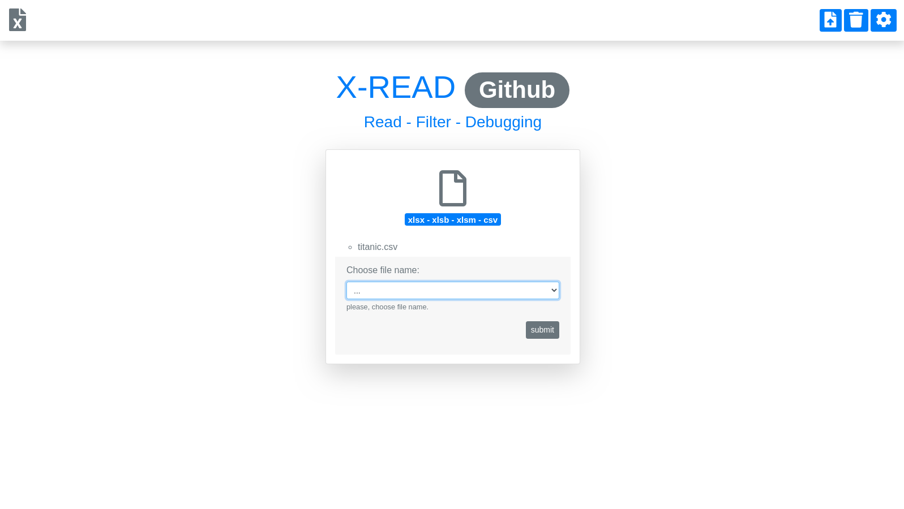

# X-READ

#### 
 *X-READ* es un proyecto de código abierto que pretende mostrar las bondades de la librería Pandas en un entorno web como Django aunque este puede desarrollarse tranquilamente en cualquier otro framework ya sea flask, Pyramid o Web2py. Las principales funciones de esta aplicación son: permitir al usuario cargar archivos de tipo hoja de cálculo ha un dashboard y la posibilidad poder filtrar los elemento de la hoja, para la versión community he liberado funciones básicas de manipulación como la posibilidad de cargar cuatro formatos de archivos, la posibilidad de seleccionar la hoja de calculo que desea abrir y ha su vez las columnas que serán cargadas aun datatable para poder filtrar los datos de manera limpia y ordenada desde una interfaz más amigable comparada con las que brindan las herramientas de hoja de cálculo.

> Requirements:
   - Django==3.0.7
   - pandas==1.0.4
   - pyxlsb==1.0.6
   - numpy==1.18.5
   - xlrd==1.2.0
   - psycopg2-binary==2.8.5

### **Template:** *index in django* 

